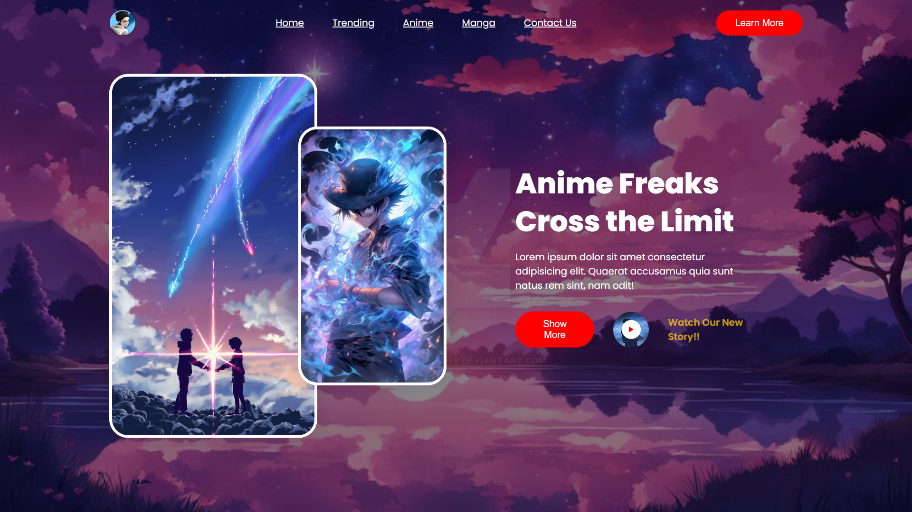

# 🎥 Anime & Manga Streaming Site 🎴

This project is a simple video streaming website focused on anime and manga content. It is built using only **HTML** and **CSS**, with a clean and responsive layout. The website allows users to browse and view their favorite anime episodes and manga chapters.

## 🌟 Features

- 📺 **Anime Streaming**: Users can stream anime episodes directly from the site.
- 📚 **Manga Reading**: Users can read manga chapters online.
- 🎨 **Simple UI**: A user-friendly and minimalistic interface to ensure ease of use.
- 💻 **HTML & CSS Only**: The entire project is created using HTML and CSS without any JavaScript or backend functionality.

## 🛠️ Technologies Used

- 🖥️ **HTML5**: Structuring the web pages and embedding video content.
- 🎨 **CSS3**: Styling the pages, including layout, fonts, and animations.

## 🚀 How to Use

1. 🔄 Clone the repository or download the source files.
2. 🌐 Open `index.html` in your preferred browser.
3. 📂 Browse through the available anime and manga content from the navigation menu.

## 🎬 Demo

## 👤 Author

This project was created by **Arpan Saha**. If you have any suggestions or feedback, feel free to reach out!

## 📄 License

This project is open-source. Feel free to contribute.
